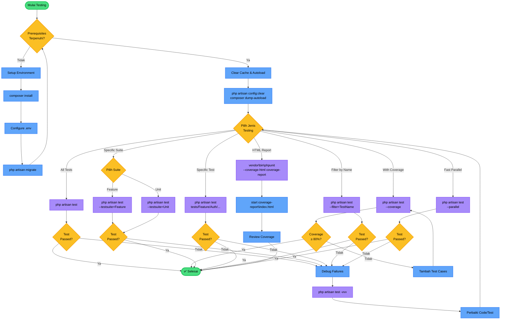

# Testing Workflow - IAE-LMS (Windows)

Panduan lengkap untuk menjalankan berbagai jenis testing pada aplikasi Learning Management System di environment Windows.

---

## 📊 Testing Workflow Diagram



**Penjelasan Diagram:**
- 🟢 **Hijau**: Start dan finish point
- 🔵 **Biru**: Proses dan action
- 🟡 **Kuning**: Decision point (pilihan)
- 🟣 **Ungu**: Command yang dijalankan

---

## Prerequisites

Pastikan aplikasi sudah terinstall dengan benar:
- Dependencies sudah terinstall (`composer install`)
- Database sudah dikonfigurasi di `.env`
- Database sudah di-migrate
- PHP sudah ada di PATH environment variable

---

## 1. Menjalankan Semua Tests

Jalankan semua test yang ada (Unit + Feature):

// turbo
```powershell
php artisan test
```

**Atau menggunakan PHPUnit langsung:**

```powershell
vendor\bin\phpunit
```

---

## 2. Menjalankan Tests dengan Coverage

Untuk melihat code coverage dari tests yang dijalankan:

```powershell
php artisan test --coverage
```

**Untuk coverage yang lebih detail (menampilkan baris yang belum ter-cover):**

```powershell
php artisan test --coverage --min=80
```

---

## 3. Menjalankan Test Berdasarkan Test Suite

**Feature Tests saja:**

```powershell
php artisan test --testsuite=Feature
```

**Unit Tests saja:**

```powershell
php artisan test --testsuite=Unit
```

---

## 4. Menjalankan Specific Test File

Jalankan satu file test tertentu:

```powershell
# Contoh: menjalankan ProfileTest
php artisan test tests/Feature/ProfileTest.php
```

**Untuk test file authentication:**

```powershell
php artisan test tests/Feature/Auth/AuthenticationTest.php
```

---

## 5. Menjalankan Specific Test Method

Filter test berdasarkan nama method atau class:

```powershell
# Filter berdasarkan nama test
php artisan test --filter=test_login_screen_can_be_rendered

# Filter berdasarkan nama class
php artisan test --filter=AuthenticationTest
```

---

## 6. Running Tests dengan Parallel Execution

Untuk mempercepat eksekusi test (jika ada banyak test):

```powershell
php artisan test --parallel
```

**Tentukan jumlah proses:**

```powershell
php artisan test --parallel --processes=4
```

---

## 7. Running Tests dengan Output Verbose

Untuk melihat detail lebih lengkap:

```powershell
php artisan test -v
```

**Atau dengan verbose level tertinggi:**

```powershell
php artisan test -vvv
```

---

## 8. Recreate Database untuk Testing

Jika perlu fresh database untuk setiap test run:

```powershell
php artisan test --recreate-databases
```

---

## 9. Generate Test Coverage Report (HTML)

Buat laporan coverage dalam format HTML:

```powershell
vendor\bin\phpunit --coverage-html coverage-report
```

Hasil report akan ada di folder `coverage-report\index.html`

**Buka report di browser:**

```powershell
start coverage-report\index.html
```

---

## 10. Membuat Test Baru

**Membuat Feature Test:**

```powershell
php artisan make:test NamaTestBaru
```

**Membuat Unit Test:**

```powershell
php artisan make:test NamaTestBaru --unit
```

---

## 11. Best Practices Testing

### Sebelum Testing:
```powershell
# Clear cache
php artisan config:clear

# Autoload classes
composer dump-autoload
```

### Environment Testing:
- Tests menggunakan environment `APP_ENV=testing` (dari `phpunit.xml`)
- Database testing bisa menggunakan SQLite in-memory atau database terpisah
- Session, cache, dan queue menggunakan driver array untuk testing

### Struktur Test:
```php
public function test_example(): void
{
    // Arrange - Setup preconditions
    $user = User::factory()->create();
    
    // Act - Execute the action
    $response = $this->actingAs($user)->get('/dashboard');
    
    // Assert - Verify the result
    $response->assertStatus(200);
}
```

---

## 12. Troubleshooting Windows

**Error: "Class not found"**
```powershell
composer dump-autoload
```

**Error: Database connection**
- Periksa konfigurasi database di `phpunit.xml`
- Pastikan database testing sudah dibuat
- Pastikan MySQL/MariaDB service sudah running

**Error: "vendor\bin\phpunit is not recognized"**
```powershell
# Gunakan PHP untuk run PHPUnit
php vendor\phpunit\phpunit\phpunit
```

**Tests terlalu lambat**
```powershell
# Gunakan parallel execution
php artisan test --parallel

# Atau gunakan SQLite untuk testing
# Edit phpunit.xml, uncomment:
# <env name="DB_CONNECTION" value="sqlite"/>
# <env name="DB_DATABASE" value=":memory:"/>
```

**Error: Permission denied pada storage**
- Pastikan folder `storage` dan `bootstrap\cache` dapat ditulis
- Klik kanan folder → Properties → Security → Edit permissions

**PHP tidak ditemukan di command line**
```powershell
# Tambahkan PHP ke PATH
# Contoh lokasi PHP di Laragon:
# C:\laragon\bin\php\php-8.2.0

# Set PATH sementara (session ini saja):
$env:Path += ";C:\laragon\bin\php\php-8.2.0"

# Atau restart terminal setelah install Laragon
```

---

## 13. Quick Commands (Copy-Paste)

**Test lengkap dengan coverage:**
```powershell
composer dump-autoload && php artisan config:clear && php artisan test --coverage
```

**Fresh test dengan database baru:**
```powershell
php artisan migrate:fresh --env=testing && php artisan test
```

**Test specific feature dengan verbose:**
```powershell
php artisan test tests/Feature/Auth --v
```

---

## 14. Test Coverage Target

- **Minimum coverage**: 70%
- **Target coverage**: 80%+
- **Critical paths**: 90%+ (Authentication, Authorization, Payment)

---

## 15. Continuous Integration (GitHub Actions)

Untuk CI/CD di GitHub Actions, tambahkan workflow file `.github\workflows\tests.yml`:

```yaml
name: Tests

on: [push, pull_request]

jobs:
  test:
    runs-on: windows-latest
    
    steps:
      - uses: actions/checkout@v3
      
      - name: Setup PHP
        uses: shivammathur/setup-php@v2
        with:
          php-version: '8.2'
          extensions: pdo_mysql, mbstring, openssl, tokenizer, xml
          
      - name: Install dependencies
        run: composer install --no-interaction --prefer-dist
        
      - name: Run tests
        run: php artisan test --parallel
```

---

## Resources

- [Laravel Testing Documentation](https://laravel.com/docs/11.x/testing)
- [PHPUnit Documentation](https://phpunit.de/documentation.html)
- Tests Location: `tests\Feature\` dan `tests\Unit\`
- PHPUnit Config: `phpunit.xml`

---

**Platform**: Windows 10/11  
**Last Updated**: 2026-01-06
