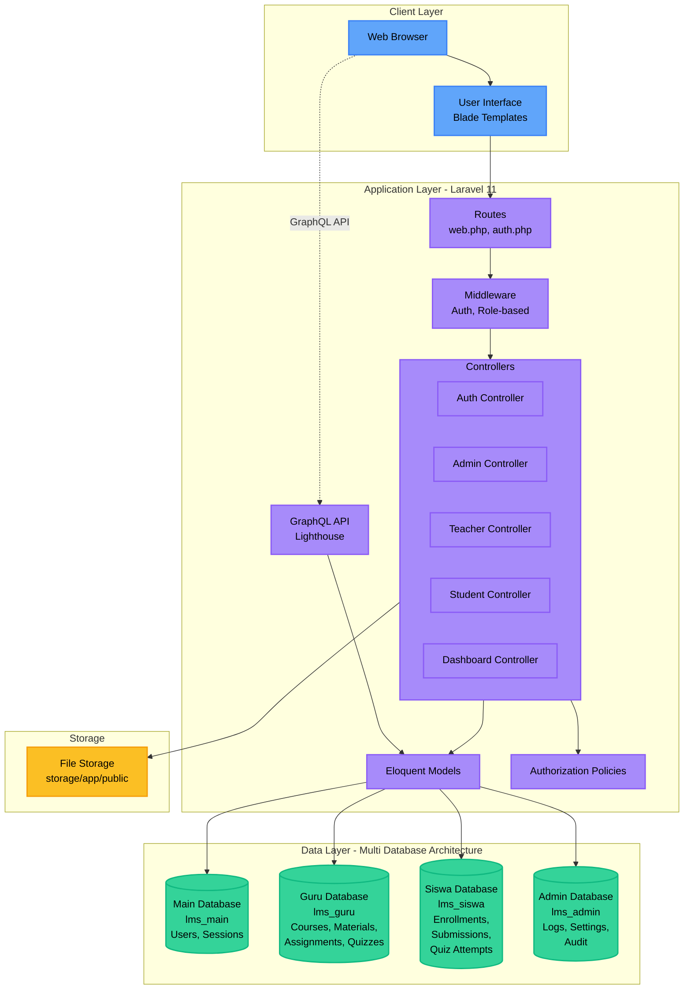
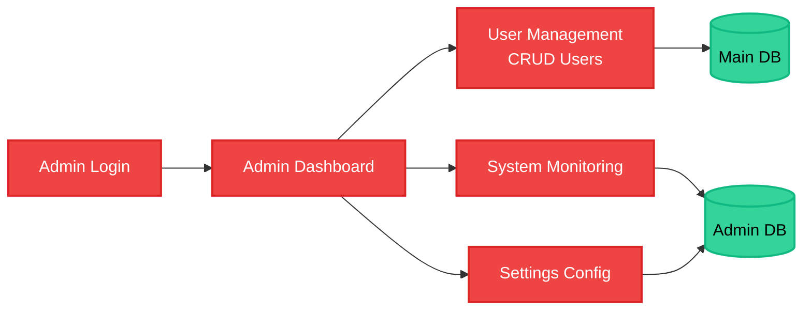
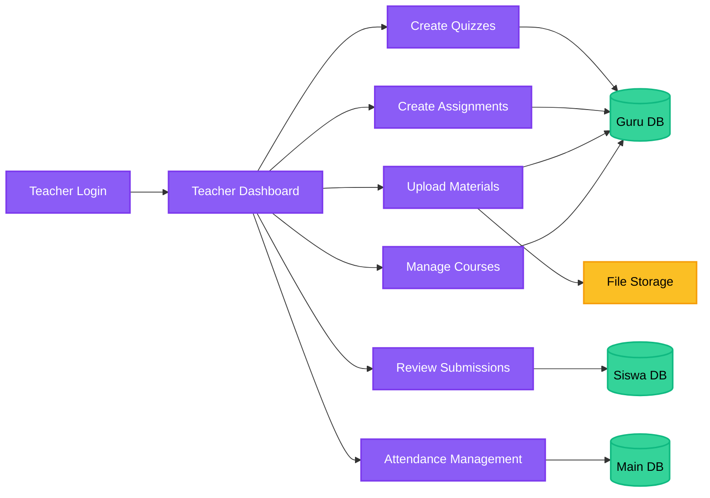
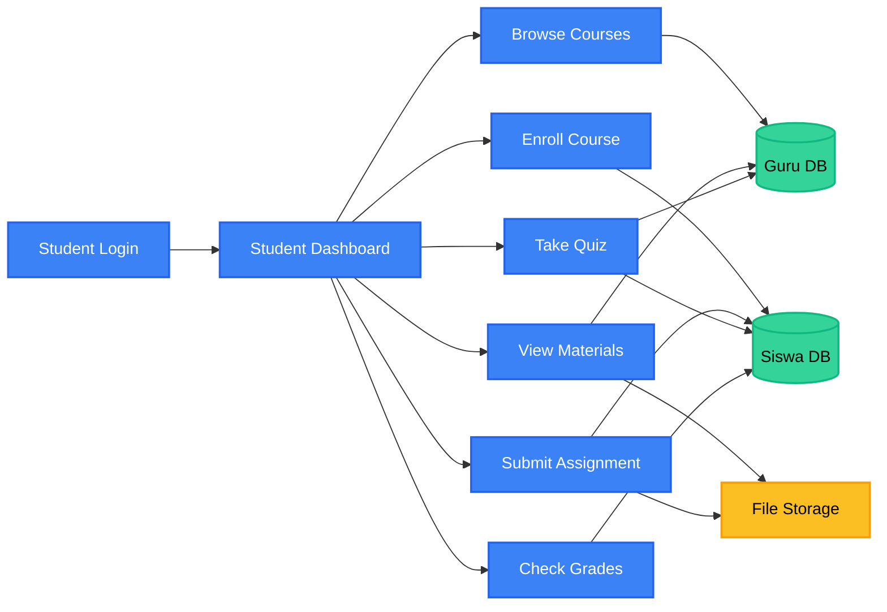
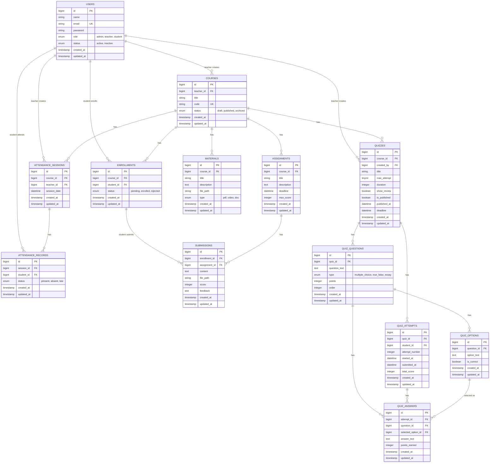
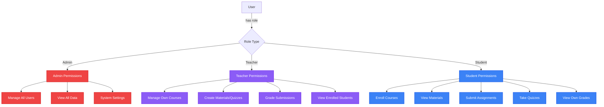
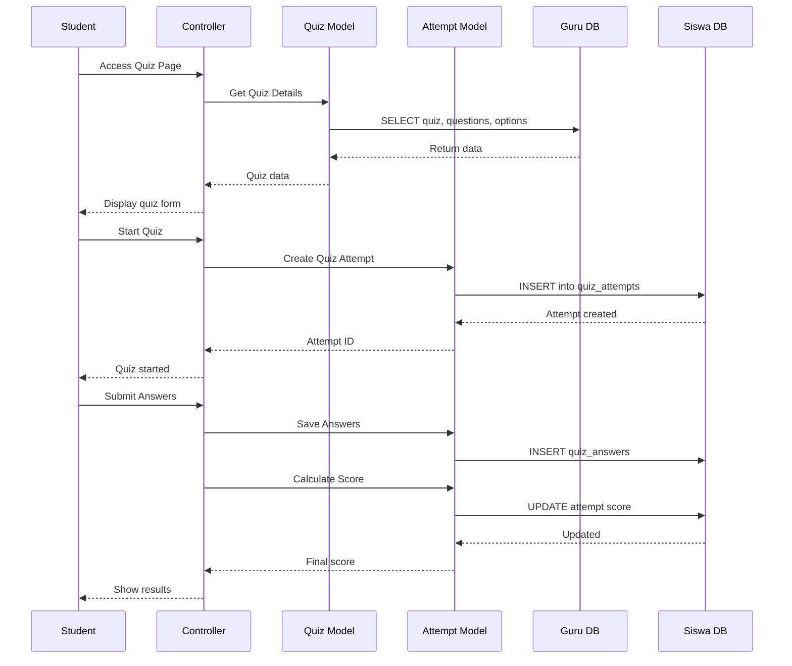

# Arsitektur dan ERD - IAE-LMS

## 📐 Arsitektur / Workflow Aplikasi

### System Architecture Overview

---

## 🔄 Application Workflow by Role

### Admin Workflow

### Teacher Workflow

### Student Workflow

---

## 🗄️ ERD / Database Schema

### Entity Relationship Diagram

---

## 🏗️ Multi-Database Distribution

### Database: `lms_main`
**Purpose**: User authentication and sessions
- ✅ users
- ✅ password_reset_tokens
- ✅ sessions
- ✅ personal_access_tokens
- ✅ cache
- ✅ jobs

### Database: `lms_guru`
**Purpose**: Teacher-managed content
- ✅ courses
- ✅ materials
- ✅ assignments
- ✅ quizzes
- ✅ quiz_questions
- ✅ quiz_options

### Database: `lms_siswa`
**Purpose**: Student activities and submissions
- ✅ enrollments
- ✅ submissions
- ✅ quiz_attempts
- ✅ quiz_answers

### Database: `lms_admin`
**Purpose**: System administration (reserved for future)
- ✅ logs
- ✅ settings
- ✅ audit_trails

---

## 🔐 Security & Authorization

### Role-based Access Control

---

## 🛠️ Technology Stack

| Layer | Technology | Version |
|-------|------------|---------|
| **Frontend** | Blade Templates | Laravel 11 |
| **CSS Framework** | Tailwind CSS | 3.x |
| **Backend** | Laravel | 11.x |
| **Language** | PHP | 8.2+ |
| **Database** | MySQL | 8.0+ |
| **API** | GraphQL (Lighthouse) | 6.x |
| **Authentication** | Laravel Sanctum | 4.x |
| **Asset Building** | Vite | 5.x |

---

## 📊 Key Features by Module

### 📚 Course Management
- ✅ Create, edit, delete courses
- ✅ Publish/archive courses
- ✅ Course enrollment system
- ✅ Unique course codes

### 📖 Materials Management
- ✅ Upload PDF, videos, documents
- ✅ Material descriptions
- ✅ File storage management

### 📝 Assignment System
- ✅ Create assignments with deadlines
- ✅ Student submission system
- ✅ Scoring and feedback
- ✅ File upload support

### 🎯 Quiz System
- ✅ Multiple choice questions
- ✅ True/false questions
- ✅ Essay questions
- ✅ Time-limited quizzes
- ✅ Multiple attempts (configurable)
- ✅ Auto-grading
- ✅ Review mode

### 📋 Attendance System
- ✅ Session-based attendance
- ✅ Present/absent/late status
- ✅ Attendance reporting

---

## 🔄 Data Flow Example: Student Takes Quiz

---

**Platform**: Windows 10/11  
**Laravel Version**: 11.x  
**Last Updated**: 2026-01-06
